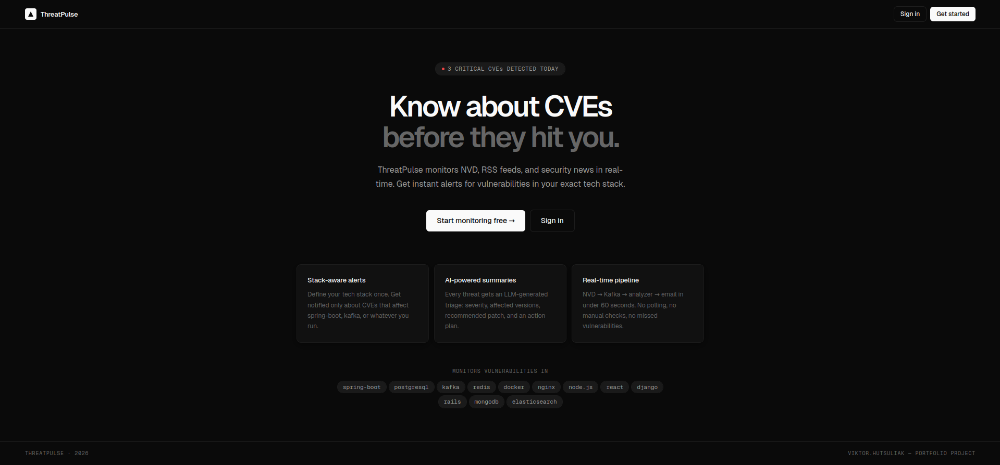
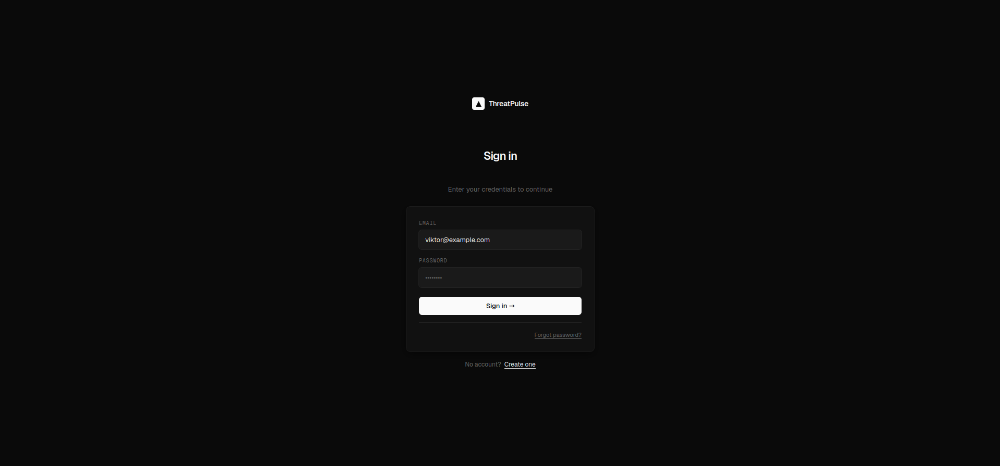
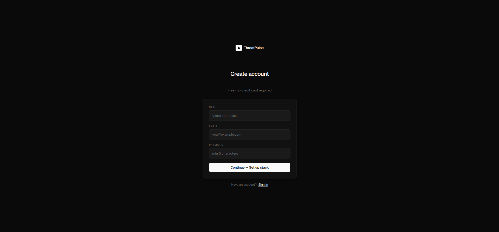
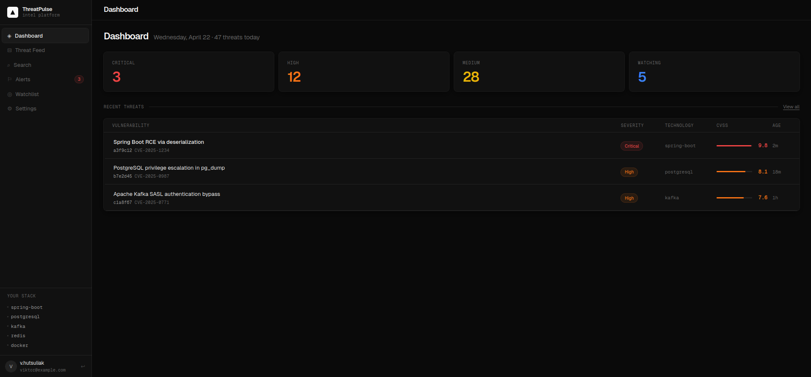
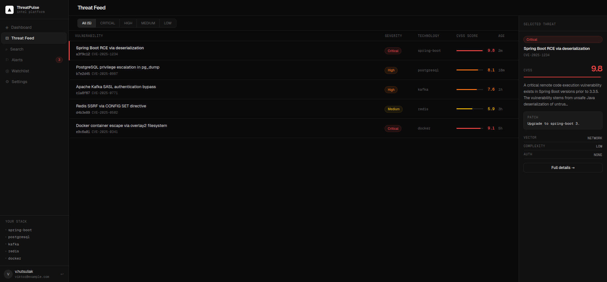
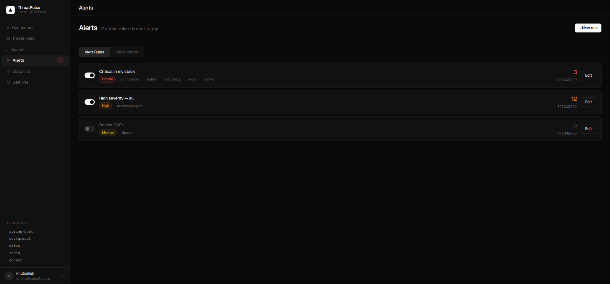
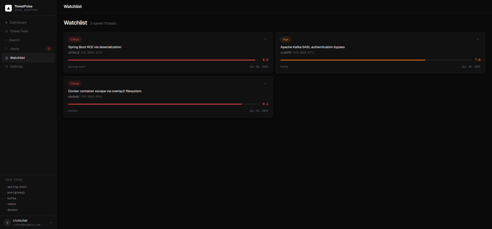
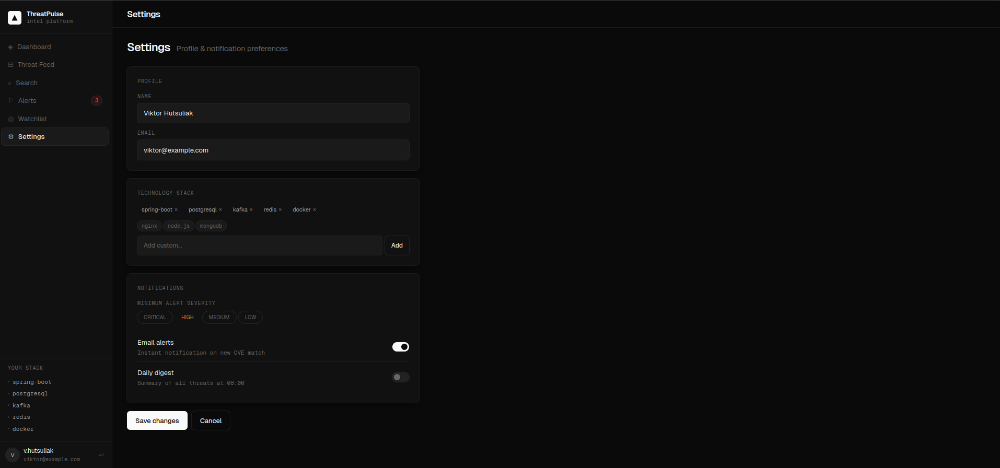

# ThreatPulse

**AI-powered cybersecurity intelligence platform** that monitors public vulnerability databases and security news, analyzes threats using large language models, and delivers personalized alerts based on your technology stack.

> Portfolio project by Viktor Hutsuliak — final-year CS student at FIIT STU, Bratislava.
> Demonstrates production-grade backend engineering: event-driven architecture, AI integration, JWT security, and async processing.

---

## The Problem

Security teams and developers struggle to keep up with the constant flow of CVEs, vulnerability disclosures, and security news. Relevant threats get buried in noise, and by the time a team learns about a critical vulnerability in a library they use — it may be too late.

## What ThreatPulse Does

ThreatPulse continuously collects threat data from multiple public sources, uses AI to extract structured insights (severity, affected technologies, recommended actions), and matches them against each user's watched tech stack — sending alerts only for what actually matters to them.

---

## Architecture

Event-driven modular monolith built on Spring Boot 3 and Apache Kafka.

```
[Data Sources]
NVD/NIST API ─────┐
Security RSS ──────┼──► Collector ──► Kafka (raw-threats) ──► Analyzer ──► PostgreSQL
NewsAPI.org ───────┘                                              │
                                                                  ├──► Kafka (analyzed-threats)
                                                                  │         │
                                                                  │    ┌────┴─────────────┐
                                                                  │    ▼                 ▼
                                                                  │  Alerts ──► Email   Feed API ──► REST
                                                                  └──► WebSocket ──► Real-time UI
```

Each module communicates only through Kafka topics or shared DTOs — no direct cross-module calls.

---

## Tech Stack

| Layer | Technologies |
|-------|-------------|
| Backend | Java 21, Spring Boot 3.3, Spring Kafka, Spring Security (JWT), Flyway |
| AI | Groq API (Llama 3.3 70B), Hugging Face Inference API (embeddings) |
| Data | PostgreSQL 16 + pgvector, Apache Kafka, Redis |
| Frontend | Vue 3, TypeScript, Quasar, Pinia, WebSocket/STOMP |
| DevOps | Docker Compose, GitHub Actions, Railway.app, Grafana Cloud |

---

## API Endpoints

### Auth
```
POST /api/auth/register
POST /api/auth/login
```

### Threats (JWT required)
```
GET /api/threats          — paginated feed with severity/category filters
GET /api/threats/{id}     — single threat detail
```

### Alert Rules (JWT required)
```
GET    /api/alerts/rules
POST   /api/alerts/rules
PUT    /api/alerts/rules/{id}
DELETE /api/alerts/rules/{id}
GET    /api/alerts/history
```

### User (JWT required)
```
GET /api/user/profile
PUT /api/user/technologies
PUT /api/user/preferences
```

---

## Frontend UI

> **Note:** The frontend is currently a UI prototype built with Vue 3 + Quasar using mock data.
> Backend integration (real API calls, JWT auth flow, WebSocket) is the next planned phase.

### Landing & Auth

| Landing Page | Login | Register |
|---|---|---|
|  |  |  |

### App

| Dashboard | Threat Feed |
|---|---|
|  |  |

| Alerts | Watchlist |
|---|---|
|  |  |



---

## Implementation Progress

### Backend
- [x] JWT authentication (register, login)
- [x] Kafka pipeline: collectors → analyzer → fan-out consumers
- [x] NVD/NIST CVE collector, RSS feed collector, NewsAPI collector
- [x] Groq AI integration — severity classification, summary, affected technologies
- [x] Threat feed REST API with pagination
- [x] Alert rules CRUD with ownership check
- [x] Email notifications via Resend API
- [x] User profile with technology stack and preferences
- [x] PostgreSQL + pgvector, Flyway migrations
- [x] Unit tests (AlertService, UserService, AuthService, ThreatAnalyzer, AnalyzerConsumer)
- [ ] Semantic search via pgvector embeddings
- [ ] Redis caching for feed
- [ ] WebSocket real-time updates
- [ ] Integration tests (Testcontainers)
- [ ] CI/CD with GitHub Actions
- [ ] Production deployment on Railway

### Frontend
- [x] Design system — CSS tokens, typography, dark theme
- [x] Landing page, login, register
- [x] App layout — sidebar, navigation, top bar
- [x] Dashboard with stat cards and recent threats table
- [x] Threat feed with filters and split-panel detail view
- [x] Threat detail page — CVSS score, affected tech, timeline
- [x] Semantic search page (UI only)
- [x] Alert rules — list, create, edit
- [x] Watchlist page
- [x] Settings — profile, tech stack, notification preferences
- [ ] Connect to backend REST API (replace mock data)
- [ ] JWT auth flow (login → store token → API interceptor)
- [ ] Real-time WebSocket updates

---

## Local Development

**Prerequisites:** Docker, Java 21, Node.js 18+

```bash
# 1. Clone the repo
git clone https://github.com/Vtoshik/threatpulse
cd threatpulse

# 2. Copy and fill in API keys
cp backend/src/main/resources/application-dev.yml.example \
   backend/src/main/resources/application-dev.yml

# 3. Start infrastructure (PostgreSQL, Kafka, Redis)
docker compose up -d

# 4. Start backend
cd backend && ./mvnw spring-boot:run -Dspring-boot.run.profiles=dev

# 5. Start frontend (optional)
cd frontend && npm install && npm run dev
```

| Service | URL |
|---------|-----|
| Backend API | http://localhost:8080 |
| Frontend | http://localhost:9000 |
| Kafka UI | http://localhost:8090 |

### Run tests

```bash
cd backend && ./mvnw test
```

---

## Required Environment Variables

| Variable | Description |
|----------|-------------|
| `DATABASE_URL` | PostgreSQL connection string |
| `KAFKA_BOOTSTRAP_SERVERS` | Kafka broker address |
| `GROQ_API_KEY` | Groq API key (free at console.groq.com) |
| `NEWS_API_KEY` | NewsAPI.org key (free tier) |
| `RESEND_API_KEY` | Resend email API key (free tier) |
| `JWT_SECRET` | Minimum 32-character secret |